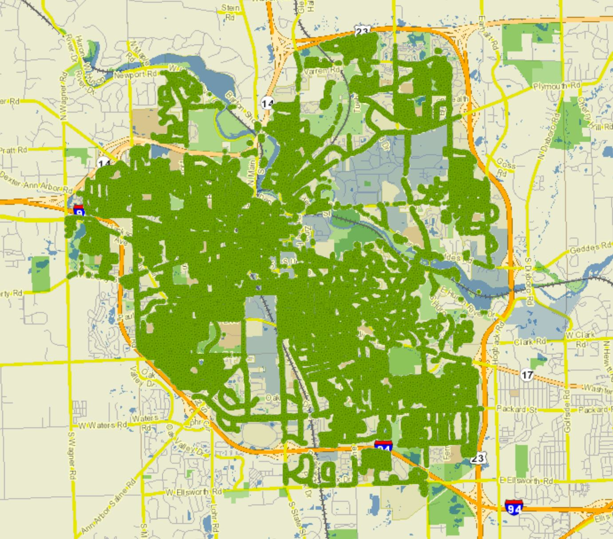
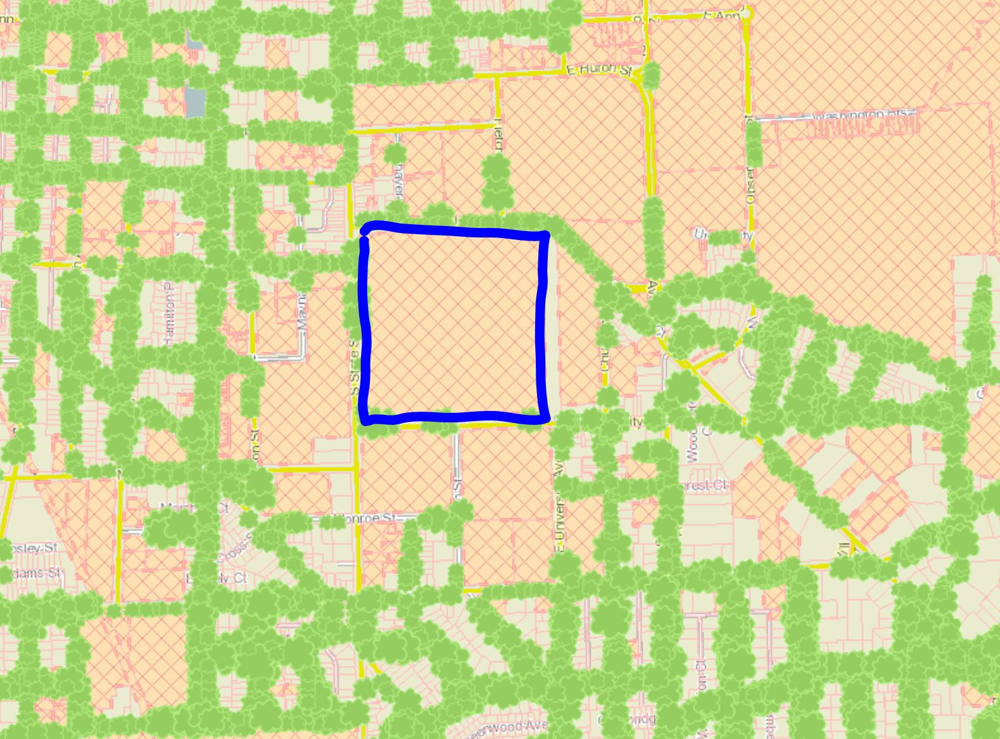
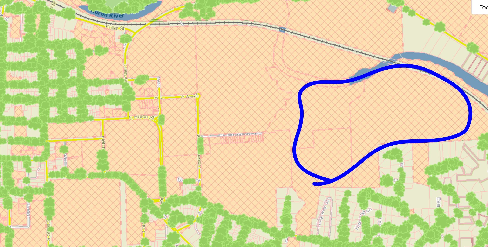

```{r setup, include=FALSE}
knitr::opts_chunk$set(echo = TRUE)
```


### Instructions

Complete the lab exercises and Dive Deeper questions below. Lab exercises will be graded out of 2 points each and the Dive Deeper questions will be graded out of 3 points each - all of them will be graded for *correctness*. Upon completion, follow the submission instructions at the bottom of this document. We strongly encourage you to work on this assignment with a partner. 

***

### Background

Aptly nicknamed "Tree Town", Ann Arbor has an abundance of trees. Starting in 2012, Ann Arbor began assessing tree health around the city and collecting data to improve the maintenance of old trees and optimizing the planting of new trees. Using the city's online mapping tool (linked below), we scraped data for a large random sample of Ann Arbor trees. The variables included in this data set are:

- `genus`: genus of the tree
- `address`: address (or park) the tree can be found at
- `health`: condition of the tree's health (1 - Good, 2 - Neutral, 3 - Bad)
- `height`: height group of the tree* (1 - Short, 2 - Medium, 3 - Tall)
- `landmark`: whether or not the tree has been designated as a "Landmark Tree" (Yes or No)
- `location`: location of the tree (Park, Street, or Trail)

*Short is defined as 0 - 20 feet, Medium is defined as 20 - 50 feet, and Tall is defined as 50 feet or more 

Source: https://www.a2gov.org/departments/forestry/Pages/The-Urban-Forest.aspx  
Mapping Tool: https://www2.a2gov.org/GIS/MapAnnArbor/NaturalFeatures/ 

Use the following code chunk to read in the data set. 

```{r readTrees}
trees <- read.csv("a2trees.csv")
```

***

### Lab Exercises

After reading in the data set above, complete the following lab exercise. Remember, these exercises are worth 2 points each and are graded for correctness.

> **1.** Use the `head()` function to preview the first 10 rows of the data set. What type of variable is `height` -- categorical nominal, categorical ordinal, quantitative continuous, or quantitative discrete? Explain your answer. 

```{r exercise1, error = T}
# Replace this text with your code!

```

*Answer:* Replace this text with your answer.


> **2.** Create a graph to visualize the variable `genus`. Required: be sure to add appropriate axis labels and a title. Optional: add some color to the plot.

```{r exercise2, error = T}
# Replace this text with your code!

```


> **3.** What proportion of the sampled trees are maple trees? Summarize the data, calculate this value, and report it below.

```{r exercise3, error = T}
# Replace this text with your code!

```

*Answer:* Replace this text with your answer.


> **4.** Generate a question that involves two categorical variables from this data set. You will analyze the data and answer this question over the next three exercises.  

*Answer:* Replace this text with your answer.


> **5.** Create a grouped bar chart that could be used to help answer your proposed question from Exercise 4. Comment on what you see from the graph.   

```{r exercise5, error = T}
# Replace this text with your code!

```

*Answer:* Replace this text with your answer.


> **6.** Create a two-way frequency table for your chosen variables. Calculate at least two probabilities that will help you answer your proposed question from Exercise 4.

```{r exercise6, error = T}
# Replace this text with your code!

```

*Answer:* Replace this text with your answer.


> **7.** Using your analysis from the previous two exercises, answer your proposed question from Exercise 4. Explain your answer.  

*Answer:* Replace this text with your answer.


***


### Dive Deeper Questions

After completing the lab exercises above, complete the following Dive Deeper questions. Remember, these questions are worth 3 points each and are graded for correctness.

> **1.** Using the bar chart from Exercise 2 above, is the following statement appropriate? "The distribution of tree genera (or genuses) is unimodal and slightly skewed to the right." Explain your answer in 1 - 2 sentences. 

*Answer:* Replace this text with your answer.


> **2.** The three images below are taken from the city of Ann Arbor's online tree-mapping tool. The first image shows all of the trees in which the city has recorded data for. The second and third image are the Diag and the Arb, respectively. From these images, it would seem that there are no trees located in the Diag or the Arb, but this is not true. This occurred because these spaces are university-owned properties and the city of Ann Arbor did not record data for these locations. Would it be reasonable to use the city's data to make conclusions about trees located on university property? In other words, is it reasonable to consider the city's sample of trees a representative sample for trees located on university property?

{width=50%}

{width=50%}

{width=50%}

*Answer:* Replace this text with your answer.


***

### Submission Instructions

Once you have finished, follow the instructions below to submit your work.

1. At the top of the document, update the `author` field. Please include your name and your partner's name, if applicable. Do not change anything else at the top of the document.

2. Click the Knit button to create an HTML file of your work.

3. In the Files pane (bottom right window), check the box next to `lab01assignment.html`. 

4. In the Files pane, click on the gear icon (More) and select "Export..."  

5. Do not change the file name (`lab01assignment.html`). Click Download and save the file to your computer. 

6. On the Stats 250 Canvas site, navigate to the Lab 1 assignment. 

7. Upload your saved `lab01assignment.html` file. 

8. Click "Submit Assignment". Congratulations, you are done with Lab 1!

